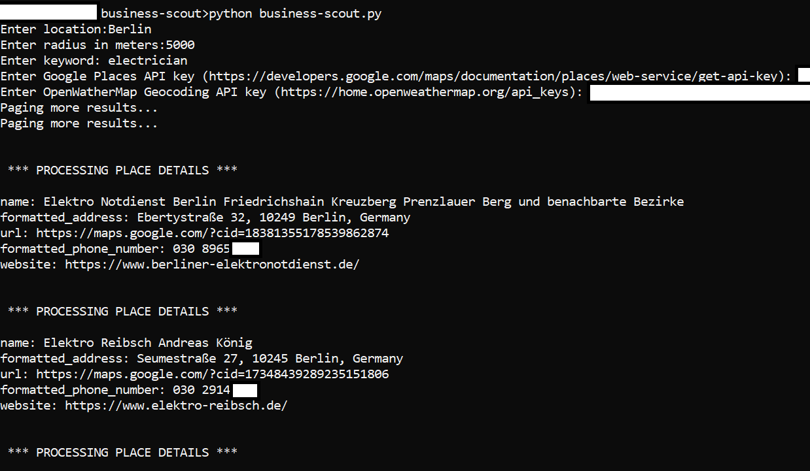

<!-- PROJECT SHIELDS -->
<!--
*** I'm using markdown "reference style" links for readability.
*** Reference links are enclosed in brackets [ ] instead of parentheses ( ).
*** See the bottom of this document for the declaration of the reference variables
*** for contributors-url, forks-url, etc. This is an optional, concise syntax you may use.
*** https://www.markdownguide.org/basic-syntax/#reference-style-links
-->

<!-- PROJECT LOGO -->
<br />
<div align="center">
  <a href="https://github.com/rguitar/business-scout">
    
  </a>
<br/>
<i>
This unnecesary logo was automatically generated using DALL-E AI.
</i>

<h3 align="center">Business Scout</h3>
 <p align="center">
    This project looks for businesses in a certain region and stores their contact information in a CSV file.
    <br />
    <a href="https://github.com/rguitar96/business-scout/issues">Report Bug</a>
    ·
    <a href="https://github.com/rguitar96/business-scout/issues">Request Feature</a>
  </p>
</div>

<!-- ABOUT THE PROJECT -->
## About The Project

I built this project during my customer development process at Entrepreneur First. It saved me quite some time to scrape, structure and store businesses that I wanted to interview for our use case.

Below, a sample for looking for electricians in Berlin is shown.

<div align="center">
  
</div>

### Built With

[](https://www.python.org/)

<!-- GETTING STARTED -->
## Getting Started

Using the script is really straight-forward, but you will need two free API keys first.

### Prerequisites

1. Get a free Google Places API Key at [https://developers.google.com/maps/documentation/places/web-service/get-api-key](https://developers.google.com/maps/documentation/places/web-service/get-api-key)
2. Get a free OpenWeatherMap API Key at [https://home.openweathermap.org/api_keys](https://home.openweathermap.org/api_keys)
3. Clone the repo
   ```sh
   git clone https://github.com/rguitar96/business-scout.git
   ```

<!-- USAGE EXAMPLES -->
## Usage

To use the script, simply type in the root folder:

```
python business-scout.py
```

Then, you will be asked a set of parameters to make your search.


<!-- LICENSE -->
## License

Distributed under the MIT License. See `LICENSE.txt` for more information.


<!-- CONTACT -->
## Contact

Rodrigo Pueblas - [@rguitar96](https://twitter.com/rguitar96) - rodrigo.pueblas@hotmail.com

Project Link: [https://github.com/rguitar96/business-scout](https://github.com/rguitar96/business-scout)

